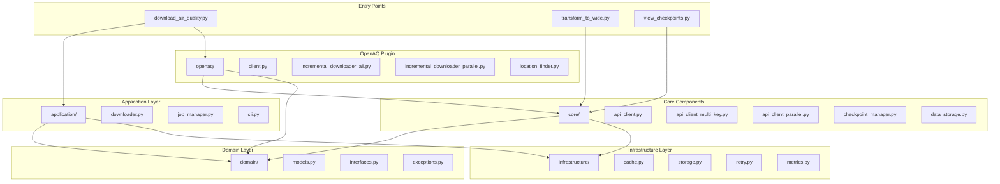
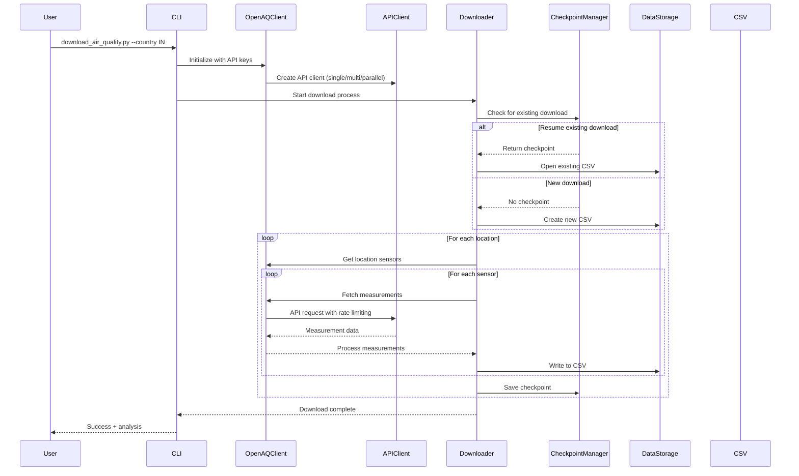
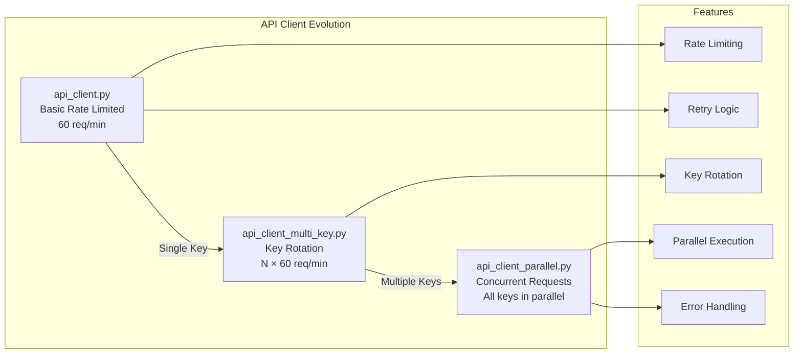
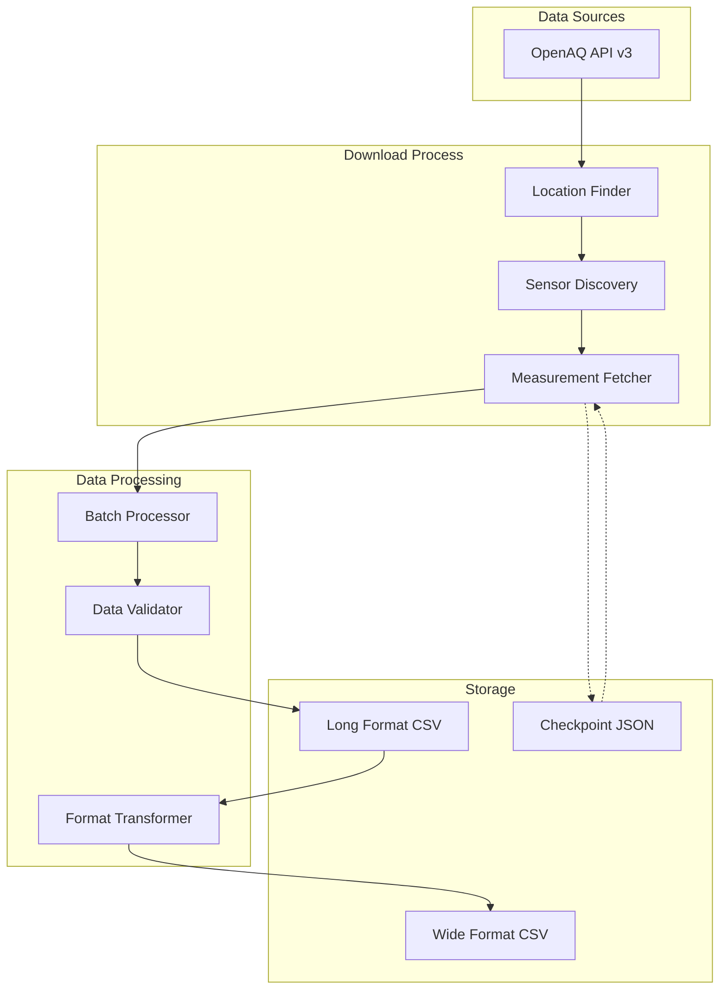
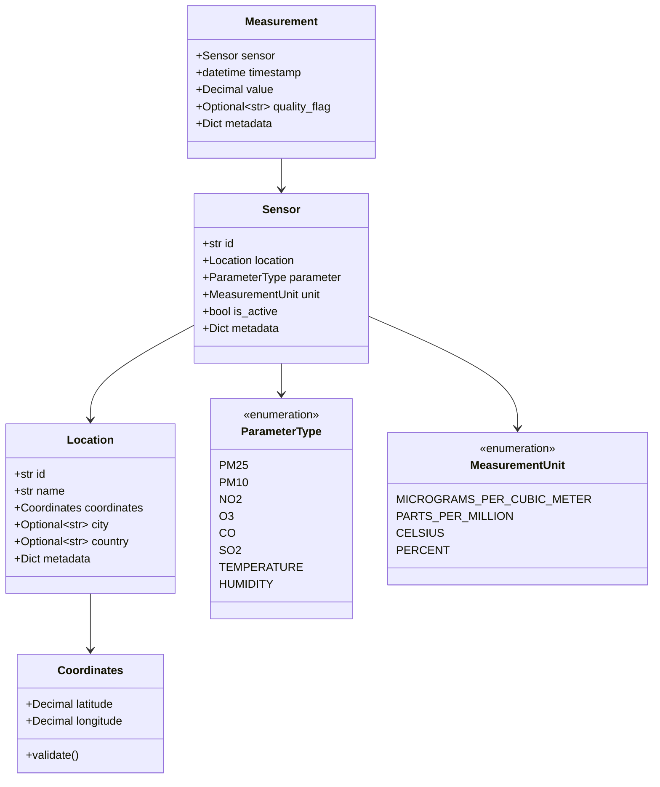
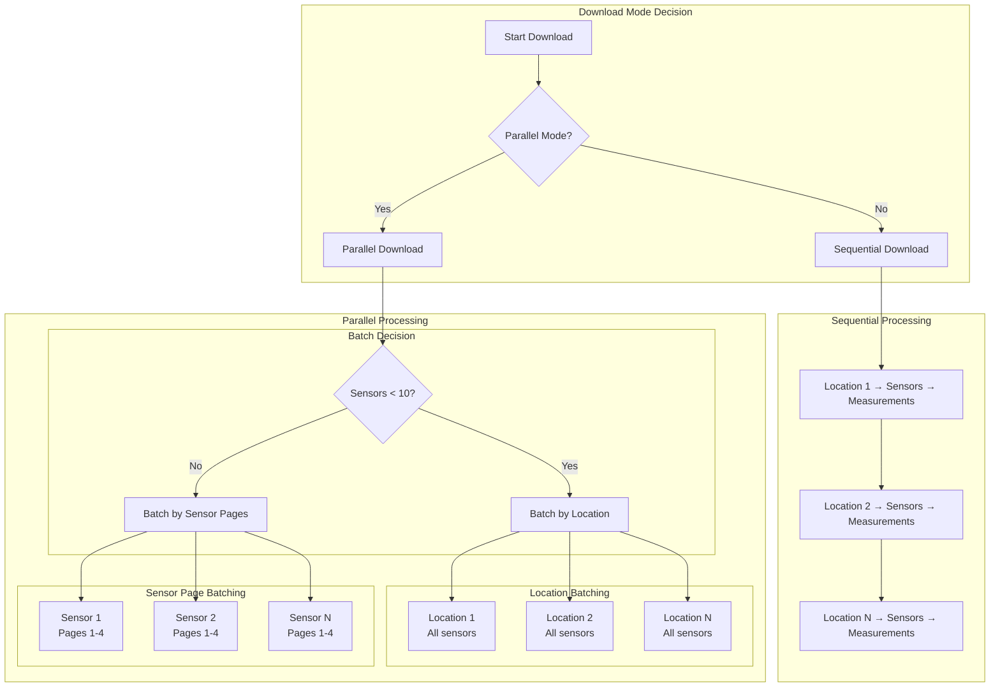
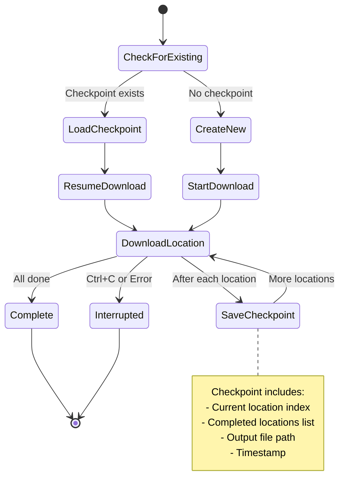

# Architecture Documentation

## Overview

This air quality data collection system follows Domain-Driven Design (DDD) principles with clear separation of concerns across layers.

## High-Level Architecture



## Component Interaction Flow



## API Client Architecture



## Data Flow



## Domain Model Structure



## Download Strategy



## Checkpoint System



## Directory Structure

```
project-root/
├── src/
│   ├── domain/           # Core business logic
│   │   ├── models.py     # Domain entities
│   │   ├── interfaces.py # Abstract interfaces
│   │   └── exceptions.py # Domain exceptions
│   │
│   ├── application/      # Application services
│   │   ├── cli.py        # CLI interface
│   │   ├── downloader.py # Download orchestration
│   │   └── job_manager.py # Job management
│   │
│   ├── infrastructure/   # Technical implementations
│   │   ├── cache.py      # Caching layer
│   │   ├── storage.py    # Storage implementations
│   │   ├── retry.py      # Retry mechanisms
│   │   └── metrics.py    # Metrics collection
│   │
│   ├── core/            # Shared components
│   │   ├── api_client*.py # API client variants
│   │   ├── checkpoint_manager.py
│   │   └── data_storage.py
│   │
│   ├── openaq/          # OpenAQ-specific
│   │   ├── client.py     # OpenAQ client
│   │   ├── location_finder.py
│   │   └── incremental_downloader*.py
│   │
│   └── utils/           # Utilities
│       ├── data_analyzer.py
│       └── csv_to_wide_format.py
│
├── data/                # Data directory
│   └── openaq/
│       ├── checkpoints/ # Checkpoint files
│       ├── processed/   # Output CSV files
│       └── raw/         # Raw data (if any)
│
├── config/              # Configuration files
├── tests/               # Test files
└── *.py                 # Entry point scripts
```

## Key Design Patterns

1. **Repository Pattern**: Abstract data access through interfaces
2. **Strategy Pattern**: Multiple API client implementations
3. **Observer Pattern**: Progress tracking and metrics
4. **Command Pattern**: CLI command handling
5. **Factory Pattern**: Dynamic client selection based on API keys

## Performance Characteristics

### Throughput
- **Single Key**: 60 requests/minute
- **Multi Key (N keys)**: N × 60 requests/minute
- **Parallel Mode**: Concurrent requests across all keys (requires multiple API keys)
- **Checkpoint Saves**: After each location (not sensor)
- **CSV Writes**: Incremental after each sensor (append mode)
- **API Limit**: Max 16 pages (16,000 measurements) per sensor
- **Download Mode**: All downloads are incremental (resumable)

### Memory Usage
- **Peak Memory**: ~200-500MB during parallel downloads (varies by concurrent keys)
- **Memory Scaling**: Linear with number of concurrent API keys
- **Deque Optimization**: Histogram storage uses collections.deque for O(1) append/pop
- **CSV Buffering**: Incremental writes prevent memory accumulation
- **Typical Usage**:
  - 1 key: ~100MB baseline
  - 10 keys: ~300MB (concurrent request buffers)
  - 100 keys: ~1-2GB (high concurrency overhead)

## Future Extension Points

1. **New Data Sources**: Implement new plugins following the domain interfaces
2. **Storage Backends**: Add database storage by implementing Storage interface
3. **Export Formats**: Extend data transformation utilities
4. **Monitoring**: Integrate with metrics collectors
5. **Scheduling**: Add job queue for automated downloads